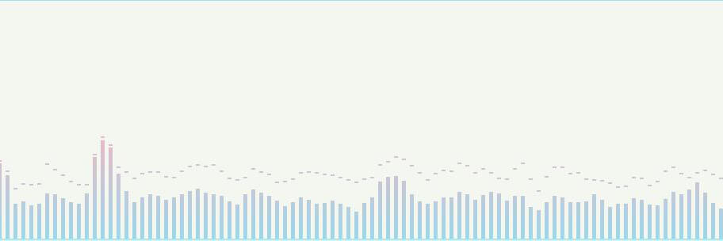
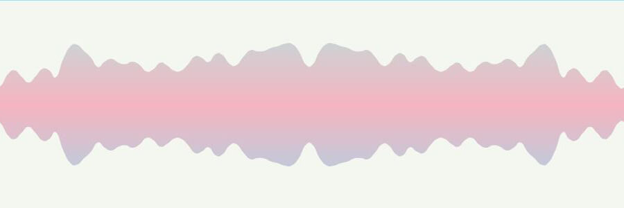

[ENGLISH](./README_EN.md)

<h1 align="center">Audio FFT</h1>

<p align="center">
    <a href="https://github.com/jiaming743/audioFft/blob/master/LICENSE"> </a>
    <a href="https://www.npmjs.com/package/@jiaminghi/audio-fft"> </a>
</p>

### 这是一个基于Canvas进行实时音乐频谱绘制的插件。

插件将传入的audio实例作为音频来源进行快速傅里叶变换得到实时频谱数据，使用Canvas将其绘出，支持多种频谱模式，可以动态切换audio实例，支持渐变色。

### npm安装

```shell
$ npm install @jiaminghi/audio-fft
```

### 使用

```javascript
import AudioFFT from '@jiaminghi/audio-fft'

const canvas = document.getElementById('canvas')
const audio = document.getElementById('audio')

const fft = new AudioFFT(canvas, {
    // some config...
})
fft.setAudio(audio)
fft.draw()
```
Demo演示效果请移步[Demo](http://demo.jiaminghi.com/#/audioFft)

* [Class AudioFFT](#Class-AudioFFT)
* [示例](#示例)

------

<h3 align="center">Class AudioFFT</h3>

### 类

```javascript
/**
 * @description Class of AudioFft
 * @param {Object} canvas Canvas DOM
 * @param {Object} config configuration
 * @return {AudioFft} AudioFft Instance
 */
export default class AudioFft {
    //...
}
```

### 配置项

* [analyserFFT](#analyserFFT)
* [spring](#spring)
* [wave](#wave)
* [symmetry](#symmetry)
* [pick](#pick)
* [colorTransition](#colorTransition)
* [colors](#colors)
* [opacity](#opacity)
* [transitionFrame](#transitionFrame)
* [columnGap](#columnGap)
* [columnWidth](#columnWidth)
* [swingScale](#swingScale)
#### analyserFFT

```javascript
/**
 * @description Analyser fast fourier transform
 * @type {Number}
 * @default analyserFFT = 2048
 */
```

#### spring

```javascript
/**
 * @description 弹簧模式
 * @type {Boolean}
 * @default spring = false
 */
```

#### wave

```javascript
/**
 * @description 波浪模式
 * @type {Boolean}
 * @default wave = false
 */
```

#### symmetry

```javascript
/**
 * @description 对称模式
 * @type {Boolean}
 * @default symmetry = false
 */
```

#### pick

```javascript
/**
 * @description 是否显示拨片（非弹簧模式下有效）
 * @type {Boolean}
 * @default pick = true
 */
```

#### colorTransition

```javascript
/**
 * @description 是否启用颜色渐变
 * @type {Boolean}
 * @default colorTransition = false
 */
```

#### colors

```javascript
/**
 * @description 频谱颜色
 * @type {Array<String>}
 * @default colors = ['#6ed4d3', '#f5738f', '#4bb7e4']
 * @example colors = ['red', '#6ed4d3', 'rgb(100, 100, 100)', 'rgba(100, 100, 100, 1)']
 */
```

#### opacity

```javascript
/**
 * @description 颜色透明度
 * @type {Number}
 * @default opacity = 1
 */
```

#### transitionFrame

```javascript
/**
 * @description 颜色渐变过程帧数
 * @type {Number}
 * @default transitionFrame = 300
 */
```

#### columnGap

```javascript
/**
 * @description 柱间间隙
 * @type {Number}
 * @default columnGap = 5
 */
```

#### columnWidth

```javascript
/**
 * @description 柱宽度
 * @type {Number}
 * @default columnWidth = 10
 */
```

#### swingScale

```javascript
/**
 * @description 频谱高度缩放比例
 * @type {Number}
 * @default swingScale = 1
 */
```

**Tip**

`colors`数组长度为1时，频谱单色绘制，长度大于1时，自动应用渐变色，启用`colorTransition`则会产生不一样的效果。

### 实例方法

* [setAudio](#setAudio)
* [draw](#draw)
* [stop](#stop)
* [updateConfig](#updateConfig)
* [clear](#clear)

#### setAudio

```javascript
/**
 * @description 设置audio实例
 * @param audio Audio实例
 * @return {Undefined} Void
 */
AudioFFT.prototype.setAudio = function (audio) {
    // ...
}
```

#### draw

```javascript
/**
 * @description 开始绘制
 * @return {Undefined} Void
 */
AudioFFT.prototype.draw = function () {
    // ...
}
```

#### stop

```javascript
/**
 * @description 停止绘制
 * @return {Undefined} Void
 */
AudioFFT.prototype.stop = function () {
    // ...
}
```

#### updateConfig

```javascript
/**
 * @description 更新配置项
 * @return {Undefined} Void
 */
AudioFFT.prototype.updateConfig = function (config = {}) {
    // ...
}
```

#### clear

```javascript
/**
 * @description 清除Canvas
 * @return {Undefined} Void
 */
AudioFFT.prototype.clear = function () {
    // ...
}
```

<h3 align="center">示例</h3>

<p align="center">
    
</p>

<p align="center">
    
</p>

<p align="center">
    
</p>

<p align="center">
    
</p>