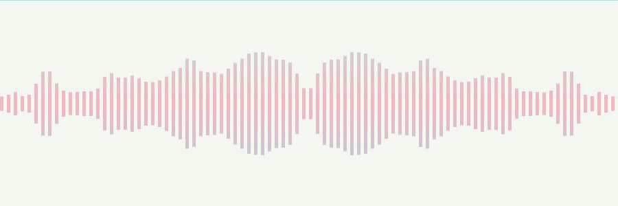

[中文](./README.md)

<h1 align="center">Audio FFT</h1>

<p align="center">
    <a href="https://github.com/jiaming743/audioFft/blob/master/LICENSE"> </a>
    <a href="https://www.npmjs.com/package/@jiaminghi/audio-fft"> </a>
</p>

### This is a plugin for real-time music frequency rendering based on canvas.

The plugin uses the incoming audio instance as an audio source for fast Fourier transform to obtain real-time frequency data, draws it out using canvas, supports multiple frequency modes, and can dynamically switch audio instances, support gradient colors.

### Install with npm

```shell
$ npm install @jiaminghi/audio-fft
```

### Use

```javascript
import AudioFFT from '@jiaminghi/audio-fft'

const canvas = document.getElementById('canvas')
const audio = document.getElementById('audio')

const fft = new AudioFFT(canvas, {
    // some config...
})
fft.setAudio(audio)
fft.draw()
```

### Quick experience

```html
<!--Resources are located on personal servers for experience and testing only, do not use in production environments-->
<!--Debug version-->
<script src="http://lib.jiaminghi.com/audiofft/audiofft.map.js"></script>
<!--Compression version-->
<script src="http://lib.jiaminghi.com/audiofft/audiofft.min.js"></script>
<script>
  const fft = new AudioFFT(params)
  // do something
</script>
```

Demo demo effect please move[Demo](http://demo.jiaminghi.com/#/audioFft)

**Tip:** Recommended to use the Chrome browser to view the Demo, if the Demo does not draw the spectrum and throw the error `AudioContext does not allow to start `, enter **chrome://flags/#autoplay-policy** in the address bar, change `Default` to `No user gesture is required` to view the Demo normally.

* [Class AudioFFT](#Class-AudioFFT)
* [Examples](#Examples)

------

<h3 align="center">Class AudioFFT</h3>

### Class

```javascript
/**
 * @description Class of AudioFft
 * @param {Object} canvas Canvas DOM
 * @param {Object} config configuration
 * @return {AudioFft} AudioFft Instance
 */
export default class AudioFft {
    //...
}
```

### config

* [analyserFFT](#analyserFFT)
* [spring](#spring)
* [wave](#wave)
* [symmetry](#symmetry)
* [pick](#pick)
* [colorTransition](#colorTransition)
* [colors](#colors)
* [opacity](#opacity)
* [transitionFrame](#transitionFrame)
* [columnGap](#columnGap)
* [columnWidth](#columnWidth)
* [swingScale](#swingScale)

#### analyserFFT

```javascript
/**
 * @description Analyser fast fourier transform
 * @type {Number}
 * @default analyserFFT = 2048
 */
```

#### spring

```javascript
/**
 * @description Spring Mode
 * @type {Boolean}
 * @default spring = false
 */
```

#### wave

```javascript
/**
 * @description Wave Mode
 * @type {Boolean}
 * @default wave = false
 */
```

#### symmetry

```javascript
/**
 * @description Symmetry Mode
 * @type {Boolean}
 * @default symmetry = false
 */
```

#### pick

```javascript
/**
 * @description Whether to show pick
 * @type {Boolean}
 * @default pick = true
 */
```

#### colorTransition

```javascript
/**
 * @description Whether to enable color transition
 * @type {Boolean}
 * @default colorTransition = false
 */
```

#### colors

```javascript
/**
 * @description Frequency colors
 * @type {Array<String>}
 * @default colors = ['#6ed4d3', '#f5738f', '#4bb7e4']
 * @example colors = ['red', '#6ed4d3', 'rgb(100, 100, 100)', 'rgba(100, 100, 100, 1)']
 */
```

#### opacity

```javascript
/**
 * @description Color opacity
 * @type {Number}
 * @default opacity = 1
 */
```

#### transitionFrame

```javascript
/**
 * @description Color transition frame
 * @type {Number}
 * @default transitionFrame = 300
 */
```

#### columnGap

```javascript
/**
 * @description Column gap
 * @type {Number}
 * @default columnGap = 5
 */
```

#### columnWidth

```javascript
/**
 * @description Column width
 * @type {Number}
 * @default columnWidth = 10
 */
```

#### swingScale

```javascript
/**
 * @description Swing scale
 * @type {Number}
 * @default swingScale = 1
 */
```


**Tip**

When the length of the `colors` is 1, the frequency is drawn in monochrome. When the length is greater than 1, the gradient is automatically applied. Enabling `colorTransition` will produce different effects.

### prototype

* [setAudio](#setAudio)
* [draw](#draw)
* [stop](#stop)
* [updateConfig](#updateConfig)
* [clear](#clear)

#### setAudio

```javascript
/**
 * @description Set audio instance
 * @param audio Audio instance
 * @return {Undefined} Void
 */
AudioFFT.prototype.setAudio = function (audio) {
    // ...
}
```

#### draw

```javascript
/**
 * @description Draw frequency
 * @return {Undefined} Void
 */
AudioFFT.prototype.draw = function () {
    // ...
}
```

#### stop

```javascript
/**
 * @description Stop drawing
 * @return {Undefined} Void
 */
AudioFFT.prototype.stop = function () {
    // ...
}
```

#### updateConfig

```javascript
/**
 * @description Update config
 * @return {Undefined} Void
 */
AudioFFT.prototype.updateConfig = function (config = {}) {
    // ...
}
```

#### clear

```javascript
/**
 * @description Clear canvas
 * @return {Undefined} Void
 */
AudioFFT.prototype.clear = function () {
    // ...
}
```

<h3 align="center">Examples</h3>

<p align="center">
    
</p>

<p align="center">
    
</p>

<p align="center">
    
</p>

<p align="center">
    
</p>